# Yaseen Haider

  <picture>
    <source media="(prefers-color-scheme: dark)" srcset="./dark.svg" />
    <source media="(prefers-color-scheme: light)" srcset="./light.svg" />
    
  </picture>

<b>Software Developer • Java / Python / C++ • Flutter (Dart) • Problem Solving</b>

  <a href="mailto:yaseenhaiderabbas@gmail.com">Email</a> •
  <a href="https://www.linkedin.com/in/yaseen-haider-01b054343">LinkedIn</a> •
  <a href="https://yaseenhaider.github.io/Webbase-Portfolio/">Portfolio</a> •
  <a href="https://leetcode.com/yaseen_haider">LeetCode</a>

---

## Focus / About
- Building clean, user-friendly apps
- Strengthening fundamentals with OOP, data structures, and algorithms
- Working on semester and portfolio projects
- Flutter mobile development

## Engineering Stack
- **Languages:** Java, Python, C++, Dart
- **Frameworks & Platforms:** Flutter
- **Web:** HTML/CSS
- **Core CS:** OOP, DSA

## Selected Projects
- **Medical App** — `medical-app`
- **Student Course Register System** — `Student-Course-Register-System`
- **Online Shopping / Store Projects** — `online-shopping-store`, `Shopping-Store-online`, `online-shop`
- **DSA Practice** — `dsa`, `DSA-in-C-`

## Coding Profiles
### LeetCode

## GitHub Stats

  
  

  

## Contact
- Email: [yaseenhaiderabbas@gmail.com](mailto:yaseenhaiderabbas@gmail.com)
- LinkedIn: [Yaseen Haider](https://www.linkedin.com/in/yaseen-haider-01b054343)
- Portfolio: [Webbase Portfolio](https://yaseenhaider.github.io/Webbase-Portfolio/)
- LeetCode: [yaseen_haider](https://leetcode.com/yaseen_haider)
